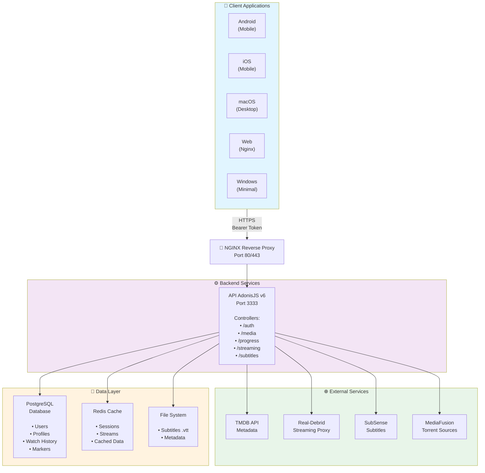
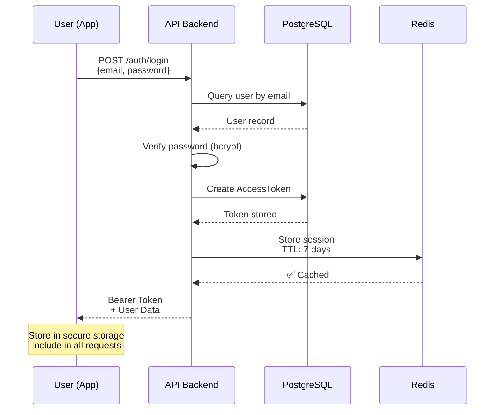
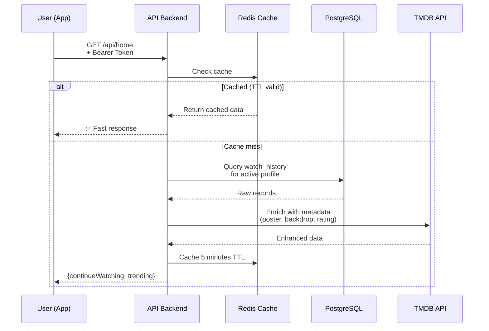
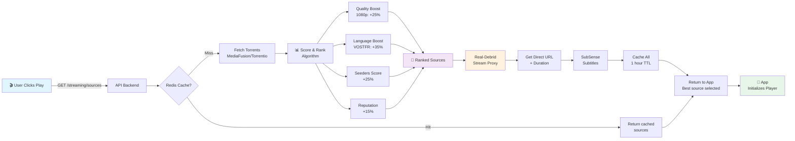
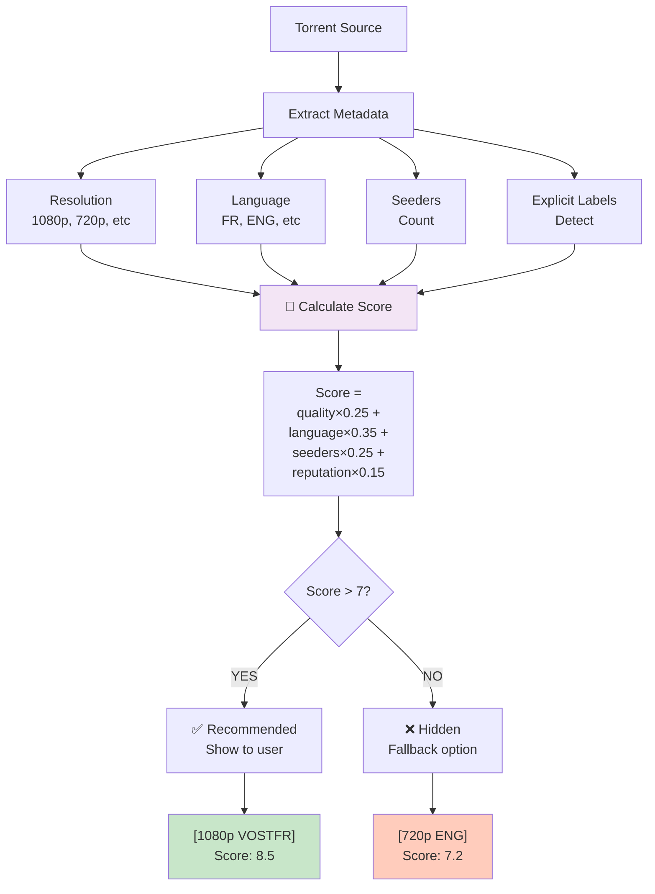
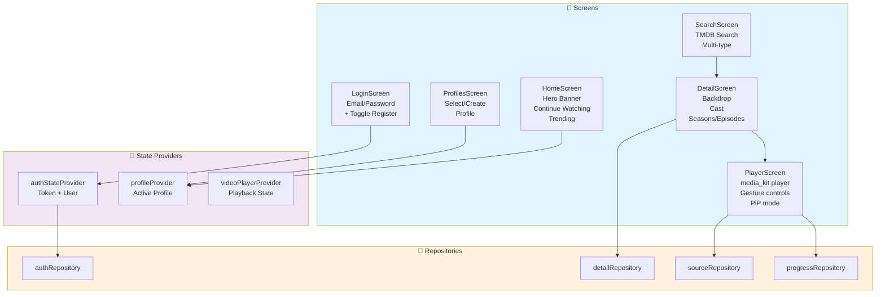
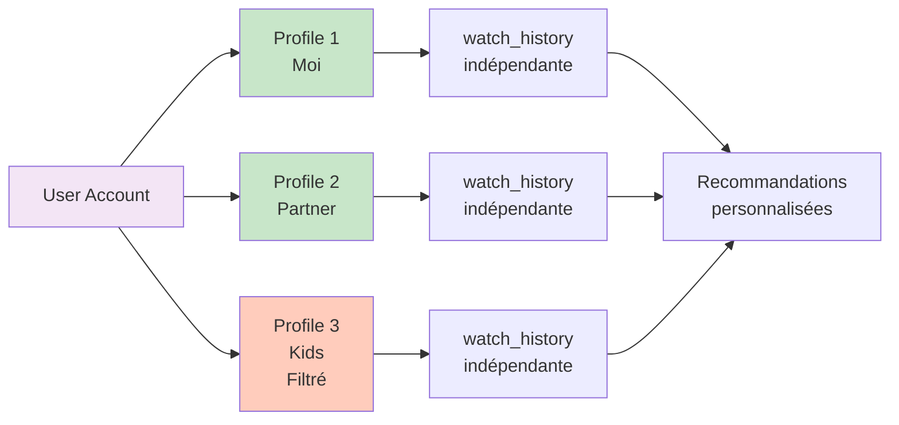
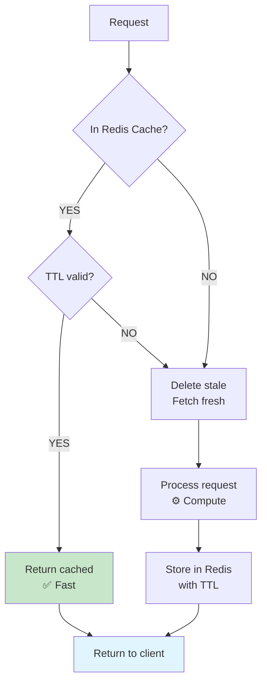

# 🎬 JojoFlix

Plateforme de streaming self-hosted multiplateforme avec support complet des sous-titres, profils utilisateur, et sources torrent smart-ranked.

## 🎯 Vue d'ensemble

JojoFlix est une suite complète pour découvrir et regarder du contenu multimédia (films, séries, documentaires) en streaming, avec:

- **Backend puissant**: API AdonisJS v6 (ESM strict), PostgreSQL, Redis cache
- **App multiplateforme**: Flutter (Android, iOS, macOS, Web)
- **Sources intelligentes**: Real-Debrid + Torrentio/MediaFusion avec ranking smart
- **Sous-titres**: Intégration SubSense pour 30+ langues
- **Profiles multiples**: Gestion multi-user comme Netflix
- **Contenu français**: Boost VOSTFR, DramaYo, support complet français

---

## 🏗️ Architecture Système



---

## 📊 Flux de Données

### 1️⃣ Authentication Flow



### 2️⃣ Media Discovery Flow



### 3️⃣ Streaming & Source Selection Flow



### 4️⃣ Intelligent Ranking Algorithm



---

## 🛠️ Composants clés

### Backend Services

| Service | Rôle |
|---------|------|
| `TmdbService` | Récupère metadata films/séries (couvertures, castings, etc) |
| `RealDebridService` | Proxy vers Real-Debrid, extraction URLs directes |
| `SubtitleService` | Gestion SubSense, conversion VTT, multi-langue |
| `TorrentScoringService` | Ranking intelligent des sources torrents |
| `CacheWrapper` | Redis wrapper pour TTL auto et invalidation |
| `StreamRegistry` | Prévient lectures concurrentes, gère sessions |
| `RecommendationService` | Suggestions basées watch_history + likes |

### App Components



---

## 🚀 Installation & Démarrage

### Prerequis
```bash
node -v         # v24+
docker -v       # latest
flutter -v      # 3.22+
```

### 1. Setup Backend

```bash
cd jojoflix-api

# Installer dépendances
npm install

# Configurer environnement
cp .env.example .env
# Éditer .env avec:
# - DB credentials
# - API keys (TMDB, Real-Debrid, SubSense, etc)
# - URLs proxy

# Lancer migrations DB
npm run ace migration:run

# Démarrer backend
npm run dev
# Backend écoute sur http://localhost:3333
```

### 2. Setup Frontend (Flutter)

```bash
cd jojoflix_app

# Installer dépendances
flutter pub get

# Générer fichiers build_runner
flutter pub run build_runner build --delete-conflicting-outputs

# Run sur device/simulator
flutter run --dart-define=API_BASE_URL=http://10.0.2.2:3333
```

### 3. Docker Compose (Complet)

Pour une stack complète (API + DB + Redis + Nginx):

```bash
# Depuis racine du projet
docker compose up --build -d

# Logs
docker compose logs -f api

# Arrêter
docker compose down
```

Services disponibles:
- **API**: `http://localhost:3333`
- **Web (Nginx)**: `http://localhost`
- **DB**: `localhost:5432`
- **Redis**: `localhost:6379`

---

## 📱 Builds & Déploiement

### Build Android (release APK)

```bash
cd jojoflix_app

flutter build apk --release \
  --dart-define=API_BASE_URL=https://api.jojoflix.com

# APK: build/app/outputs/flutter-app.apk
```

### Build iOS (release)

```bash
flutter build ios --release \
  --dart-define=API_BASE_URL=https://api.jojoflix.com

# Ouvrir dans Xcode pour signing + deploy
open ios/Runner.xcworkspace
```

### Deploy Backend

```bash
# Sur serveur, depuis /app/jojoflix-api/
docker compose -f docker-compose.server.yml up -d --build

# Vérifier health
curl https://api.jojoflix.com/
# {"status": "ok", "service": "jojoflix-api"}
```

---

## 🔑 Variables d'environnement

**Backend** (`.env`):
```bash
# Core
APP_KEY=your-secret-key
APP_URL=http://localhost:3333
NODE_ENV=production

# Database
DB_HOST=postgres
DB_PORT=5432
DB_USER=jojoflix
DB_PASSWORD=secure-pwd
DB_DATABASE=jojoflix

# Redis
REDIS_HOST=redis
REDIS_PORT=6379

# APIs externes
TMDB_API_KEY=your_tmdb_key
RD_API_KEY=your_realdebrid_key
SUBSENSE_API_KEY=your_subsense_key
MEDIAFUSION_URL=https://provider/manifest.json
```

**App** (build-time):
```bash
--dart-define=API_BASE_URL=https://api.jojoflix.com
```

---

## 🧪 Tests & Qualité

```bash
# Backend
cd jojoflix-api
npm run typecheck    # Type checking TypeScript
npm run lint         # ESLint

# Frontend
cd jojoflix_app
flutter analyze      # Static analysis
flutter test         # Unit tests
flutter test --coverage
```

---

## 📚 Flux métier détaillés

### Profils utilisateur

Chaque utilisateur peut avoir **plusieurs profils** (comme Netflix):



### Système de caching



---

## 🐛 Dépannage courant

| Problème | Solution |
|----------|----------|
| **Login échoue** | Vérifier API_BASE_URL au build, certificat SSL, backend running |
| **Pas de sources** | Vérifier Real-Debrid API key, quota atteint? |
| **Subtitles manquent** | Vérifier SubSense API key, language code |
| **Lag lecteur** | Réduire qualité source, vérifier bande passante |
| **Crash au démarrage** | `flutter clean` puis rebuild, version Flutter à jour? |

---

## 📖 Références

- **Backend**: [AdonisJS v6 Docs](https://docs.adonisjs.com/)
- **Frontend**: [Flutter Docs](https://flutter.dev/docs)
- **APIs**: [TMDB](https://developer.themoviedb.org/), [Real-Debrid](https://api.real-debrid.com/), [SubSense](https://subsense.dev/)
- **Streaming**: [MediaFusion](https://mediafusion.dev/), [Torrentio](https://torrentio.stremio.com/)

---

**Made with ❤️ • Self-hosted streaming made simple**
