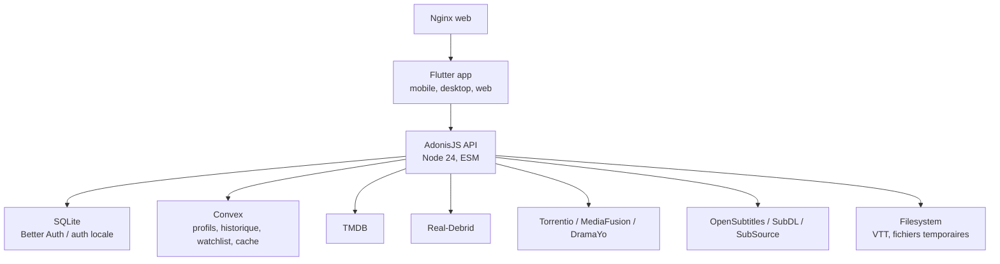

# JojoFlix

JojoFlix est une plateforme de streaming self-hosted avec une API AdonisJS, une
application Flutter multiplateforme, un monitor web leger et une couche de
donnees applicatives Convex.

Le depot est un monorepo:

| Chemin | Role |
| --- | --- |
| `jojoflix-api/` | API AdonisJS v6, streaming, sources, sous-titres, auth, Convex |
| `jojoflix_app/` | App Flutter Android, iOS, macOS, Web et desktop |
| `jojoflix_monitor/` | Dashboard Vite/React pour observer les sessions actives |
| `docker-compose.yml` | Stack locale/prod simple: API + Nginx web |
| `caddy/`, `nginx/` | Reverse proxy et serving web |

## Architecture



Le contrat principal reste REST cote app. Convex est appele par l'API via
`jojoflix-api/app/services/convex_repository.ts`, ce qui permet d'ameliorer la
donnee backend sans imposer un rebuild Flutter pour chaque optimisation.

## Donnees Convex

Convex porte les donnees produit qui changent souvent:

| Domaine | Details |
| --- | --- |
| Profils | `getProfilesByUser`, `getProfileOfUser`, creation, update, suppression |
| Watch history | Progression par profil, film ou episode TV, reprise continue |
| Watchlist | Stockee dans `profile.preferences.watchlist` et exposee par l'API |
| Interets | Scores par genre pour alimenter les recommandations |
| Markers media | Intro/outro par `tmdbId` |
| Cache API | Entrees TTL via `CacheWrapper` et fonctions `jojoflix:*` |

Points importants des dernieres evolutions:

- `/api/home/:profile_id` assemble les lignes accueil depuis Convex, TMDB et la
  watchlist, puis met le resultat en cache court.
- Le cache accueil utilise la cle `home:rows:v2:${profileId}` avec environ 20
  secondes de TTL.
- `ProgressController` invalide le cache accueil apres `progress/sync`.
- `WatchlistController` invalide le cache accueil apres ajout ou retrait.
- La reprise TV cherche le dernier episode actif d'une serie via
  `getWatchHistoriesByTmdb`, pas seulement une entree `(tmdbId, mediaType)`.
- Les formes de reponse REST existantes doivent rester stables pour l'app.

## API

Routes principales:

| Route | Role |
| --- | --- |
| `GET /health` | Healthcheck API |
| `POST /api/auth/register`, `POST /api/auth/login` | Creation compte et login |
| `GET/POST/PUT/DELETE /api/profiles` | Profils Convex |
| `GET /api/home/:profile_id` | Accueil personnalise |
| `GET /api/browse/:mediaType` | Lignes browse films/series |
| `GET /api/media/:mediaType/:tmdbId` | Detail film/serie |
| `GET /api/search` | Recherche TMDB |
| `GET /api/sources/...` | Selection manuelle des sources |
| `GET /api/stream/...` | Streaming direct ou proxy |
| `GET/POST /api/subtitles/...` | Liste, download, VTT, markers |
| `GET /api/progress/:mediaType/:tmdbId` | Reprise de lecture |
| `POST /api/progress/sync` | Synchronisation progression |
| `GET/POST/DELETE /api/profiles/:id/watchlist` | Watchlist |
| `GET /api/download/...` | Liens de telechargement |

## Prerequis

- Node.js 24+
- npm
- Flutter 3.22+ recommande
- Docker et Docker Compose pour la stack containerisee
- Un deploiement Convex avec les fonctions `jojoflix:*`
- Cles TMDB, Real-Debrid et fournisseurs de sous-titres selon les features testees

## Configuration

Deux exemples existent:

- `.env.example` pour la stack Docker racine.
- `jojoflix-api/.env.example` pour lancer l'API seule en local.

Variables importantes:

| Variable | Role |
| --- | --- |
| `APP_KEY` | Cle Adonis, a generer avec `node ace generate:key` |
| `APP_URL` | URL publique de l'API |
| `DB_PATH` | Chemin SQLite pour les tables d'auth locale |
| `CONVEX_URL` | URL HTTP du deploiement Convex |
| `CONVEX_ADMIN_KEY` | Cle serveur Convex, jamais cote client |
| `RD_API_KEY` | Real-Debrid |
| `TMDB_API_KEY` | TMDB |
| `OPENSUBS_API_KEY`, `SUBDL_API_KEY`, `SUBSOURCE_API_KEY` | Sous-titres |
| `TORRENTIO_URL`, `MEDIAFUSION_URL`, `DRAMAYO_URL` | Providers de sources |
| `TORRENTIO_PROXY` | Proxy optionnel, par exemple Tor en prod |

Ne commitez jamais de `.env`, cle provider, URL provider personnalisee avec
token, ou compose contenant des secrets en clair.

## Lancer l'API

```bash
cd jojoflix-api
npm install
cp .env.example .env
node ace migration:run
npm run dev
```

L'API ecoute par defaut sur `http://localhost:3333`.

Checks backend:

```bash
cd jojoflix-api
npm run typecheck
npm run lint
```

## Lancer l'app Flutter

```bash
cd jojoflix_app
flutter pub get
dart run build_runner build --delete-conflicting-outputs
flutter run --dart-define=API_BASE_URL=http://localhost:3333
```

Sur emulateur Android, utiliser souvent `http://10.0.2.2:3333` comme base URL.

Checks Flutter:

```bash
cd jojoflix_app
dart format lib test
flutter analyze
flutter test
```

## Stack Docker

```bash
cp .env.example .env
docker compose up --build -d
docker compose logs -f api
```

Services par defaut:

- API: `http://localhost:3333`
- Web: `http://localhost`
- SQLite API: volume Docker `sqlite_data`

Le build web Flutter doit etre produit avant de servir l'app via Nginx:

```bash
cd jojoflix_app
flutter build web --dart-define=API_BASE_URL=https://jojoflixapi.jojoserv.com
```

## Deploiement

Le Dockerfile de l'API attend un build Adonis deja produit:

```bash
cd jojoflix-api
npm install
npm run build
docker build -t jojoflix-api:latest .
```

Avant tout deploiement:

1. Verifier que le compose cible utilise des variables d'environnement et aucun
   secret en clair.
2. Verifier `CONVEX_URL`, `CONVEX_ADMIN_KEY`, `DB_PATH`, `APP_URL` et les cles
   providers sur la machine cible.
3. Verifier le healthcheck public: `curl https://jojoflixapi.jojoserv.com/health`.
4. Pour un incident prod, distinguer API up et playback casse: le healthcheck
   peut etre vert alors que Torrentio, Real-Debrid ou les sous-titres echouent.

## Points d'attention

- Les sources streaming sont externes et peuvent etre rate-limitees ou renvoyer
  des URLs mortes. Lire les logs provider avant de conclure a une panne API.
- `StreamRegistry` est en memoire process; il ne doit pas etre traite comme une
  source de verite durable.
- Les fichiers VTT et temporaires vivent cote API, pas dans Convex.
- Les optimisations backend doivent preserver les payloads REST consommes par
  Flutter.
- Un changement direct Convex-dans-Flutter implique un rebuild et doit etre
  justifie par un gain clair.

## Contribution

Avant d'ouvrir une PR ou de pousser une branche:

```bash
git status --short
cd jojoflix-api && npm run typecheck
cd ../jojoflix_app && flutter analyze && flutter test
```

Si la modification touche seulement l'API, `npm run typecheck` est le minimum.
Si elle touche l'app, lancer aussi `dart format`, `flutter analyze` et les tests
Flutter cibles.

Voir aussi `AGENTS.md` pour les invariants de reprise, les commandes utiles et
les pieges connus du projet. Le contexte d'import public apres developpement
prive est detaille dans `docs/PROJECT_HISTORY.md`.
